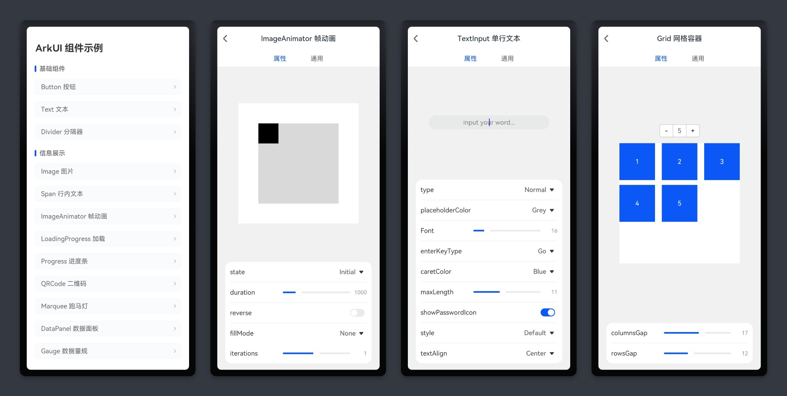

# ArkUI_Component

#### 简介

ArkUI组件库示例App。包括基础组件、容器组件、弹窗组件，可以在预览器或真机中，实时预览组件接口、属性调整的效果。

#### ArkUI 组件示例覆盖情况

> 继续研究更新中

|          | 组件名称           | ArkUI组件示例 | 备注                |
| -------- | ------------------ | ------------- | ------------------- |
| 基础组件 | AlphabetIndexer    | -             |                     |
|          | Blank              | -             |                     |
|          | Button             | ✅             |                     |
|          | Checkbox           | ✅             | 和CheckboxGroup一起 |
|          | CheckboxGroup      | ✅             |                     |
|          | DataPanel          | ✅             |                     |
|          | DatePicker         | ✅             |                     |
|          | Divider            | ✅             |                     |
|          | Gauge              | ✅             |                     |
|          | Image              | ✅             |                     |
|          | ImageAnimator      | ✅             |                     |
|          | LoadingProgress    | ✅             |                     |
|          | Marquee            | ✅             |                     |
|          | Menu               | ✅             |                     |
|          | MenuItem           | -             |                     |
|          | MenuItemGroup      | -             |                     |
|          | Navigation         | -             |                     |
|          | NavRouter          | -             |                     |
|          | NavDestination     | -             |                     |
|          | PatternLock        | ✅             |                     |
|          | Progress           | ✅             |                     |
|          | QRCode             | ✅             |                     |
|          | Radio              | ✅             |                     |
|          | Rating             | ✅             |                     |
|          | RichText           | -             |                     |
|          | ScrollBar          | -             |                     |
|          | Search             | ✅             |                     |
|          | Select             | ✅             |                     |
|          | Slider             | ✅             |                     |
|          | Span               | ✅             |                     |
|          | Stepper            | ✅             | 和StepperItem一起   |
|          | StepperItem        | ✅             |                     |
|          | Text               | ✅             |                     |
|          | TextArea           | ✅             |                     |
|          | TextClock          | ✅             |                     |
|          | TextInput          | ✅             |                     |
|          | TextPicker         | ✅             |                     |
|          | TextTimer          | ✅             |                     |
|          | TimePicker         | ✅             |                     |
|          | Toggle             | ✅             |                     |
|          | Web                | -             |                     |
|          | XComponent         | -             |                     |
| 容器     | Badge              | ✅             |                     |
|          | Column             | ✅             |                     |
|          | ColumnSplit        | -             |                     |
|          | Counter            | ✅             |                     |
|          | Flex               | ✅             |                     |
|          | FlowItem           | -             |                     |
|          | GridCol            | -             |                     |
|          | GridRow            | -             |                     |
|          | Grid               | ✅             | 和GridItem一起      |
|          | GridItem           | ✅             |                     |
|          | List               | ✅             |                     |
|          | ListItem           | ✅             | 和ListItem一起      |
|          | ListItemGroup      | -             |                     |
|          | Navigator          | -             |                     |
|          | Panel              | ✅             |                     |
|          | Refresh            | -             |                     |
|          | RelativeContainer  | -             |                     |
|          | Row                | ✅             |                     |
|          | RowSplit           | -             |                     |
|          | Scroll             | ✅             |                     |
|          | SideBarContainer   | ✅             |                     |
|          | Stack              | ✅             |                     |
|          | Swiper             | ✅             |                     |
|          | Tabs               | ✅             |                     |
|          | TabContent         | -             |                     |
|          | WaterFlow          | -             |                     |
| 弹窗     | 警告弹窗           | ✅             |                     |
|          | 列表选择弹窗       | ✅             |                     |
|          | 自定义弹窗         | ✅             |                     |
|          | 日期滑动选择器弹窗 | ✅             |                     |
|          | 时间滑动选择器弹窗 | ✅             |                     |
|          | 文本滑动选择器弹窗 | ✅             |                     |

